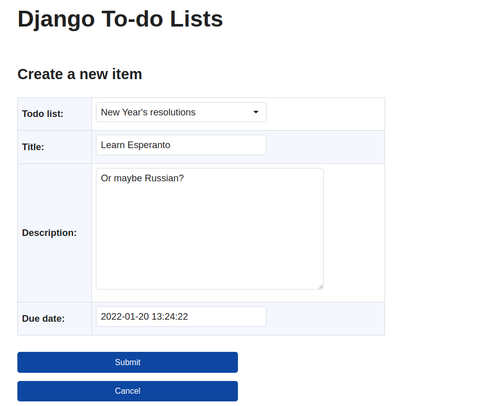
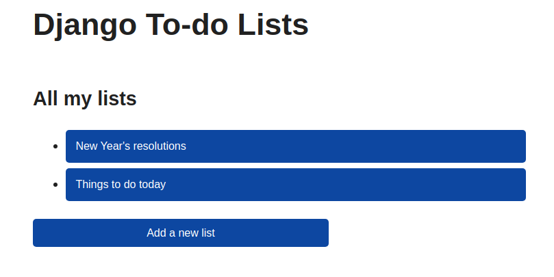
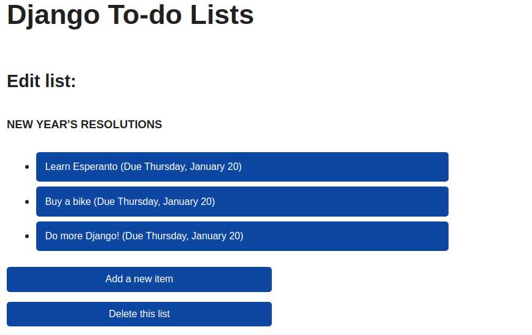

# To-Do-Lists

based on [realpython website tutorial](https://realpython.com/django-todo-lists)

in this project we use django generic class-based view for our views

this website is a simple todo lists for works todo!

- this page shows how to create new item

- here we can see all lists of to-do

- shows all todo items of a list
